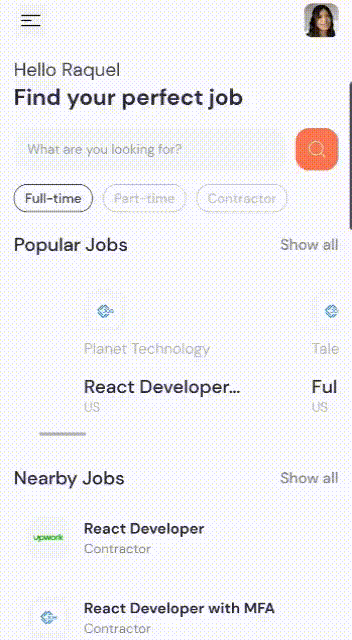

<h1 align="center">Jobs APP </h1>

Este proyecto fue construido con [`Expo-Router`](https://expo.github.io/router)

## Acerca del proyecto

Este proyecto consta de la creación de una aplicación que permite ver la información de diferentes ofertas de empleo, así como filtrar las vacantes dependiendo los interes del usuario.

### Demo

 
 

     
    
     

### Tecnologias utilizadas
1. Expo Router
2. Rapid api
3. Axios

